# intro2ai
Project of intro2ai class, Prof.Zhang Jianming, CSE       TA:Li Xinyu

Implements of eight puzzle problems，using A* algorithm

**Thanks to my teammates: Zhiye He, Haoying Li, Zijian Zhang**

C++/Qt : Desktop Qt 5.14.0 GCC 64 bit, Ubuntu 18.04

# 1 问题描述

## 1.1 八数码问题

在 3×3 的棋盘上,摆有八个棋子,每个棋子上标有 1 至 8 的某一数字,每一格数字不
同。棋盘中留有一个空格,空格用 0 来表示。空格周围的棋子可以移到空格中。要求解的问
题是:给出一种初始布局和目标布局的路径,实现从初始布局到目标布局的转变。

## 1.2 实验要求

(1)至少定义 3 种不同的启发式函数,编程实现求解八数码问题的算法;
(2)要求用可视化界面演示算法的执行过程,应能够选择预定义启发式函数,能随机初始
化状态,能单步执行,也能连续执行,能画出搜索树,同时标出估价函数在每个节点的各项
函数值,能展示 OPEN 表和 CLOSED 表的动态变化过程;
(3)能统计出扩展节点数和短发执行时间,以便对采用不同的启发式函数的算法的性能进
行对比研究;
(4)提出改进思路并编程是西安改进的算法,并实验对比改进前后的算法性能。

# 2 算法描述

## 2.1 求解八数码问题

我们对于八数码问题的求解采用 A*算法,A*算法的算法思路如下图所示,将初始节点放
入 openlist 中,然后每次在 openlist 中找到最小的节点加入到 closelist 中,如果最后加
入的是目标节点,那么搜索结束,通过回溯找到整个路径,这个过程中也涉及重复性的检查,
最终得到结果。

对于 A*算法,启发式函数是至关重要的一个环节,一个好的启发式函数会大大有利于搜
素的时间的缩短和搜索过程的简化,本次算法采用了不同中的启发式函数,下面分别予以说
明。
我们的启发式函数有以下几种:不在位置的方块个数,曼哈顿距离,欧式距离还有逆序数。
这几种启发式函数都比较好理解,可以以下面可视化的方式进行理解。其中逆序数指的是每
一个数之前比这个数大的个数,在八数码问题中不考虑 0,然后将所有的逆序数相加就是这
个情境下的逆序数。

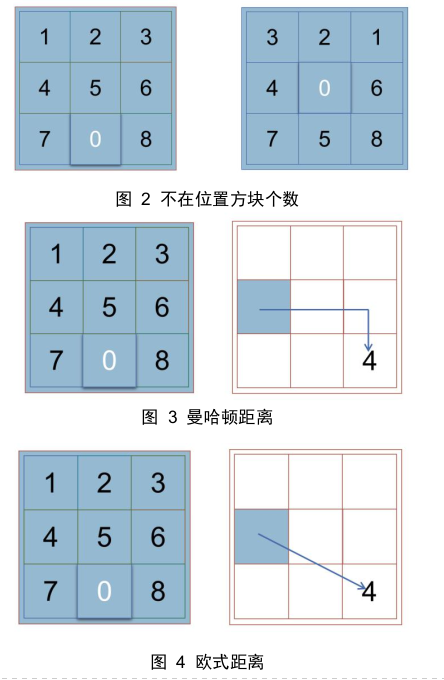

## 2.2 程序设计总体架构与功能实现

### 2.2.1 程序设计总体架构

程序设计采用 C++编程语言,采用 Qt 这个平台进行可视化,主要的代码架构如下:

程序设计采用C++编程语言，采用Qt这个平台进行可视化，主要的代码架构如下：

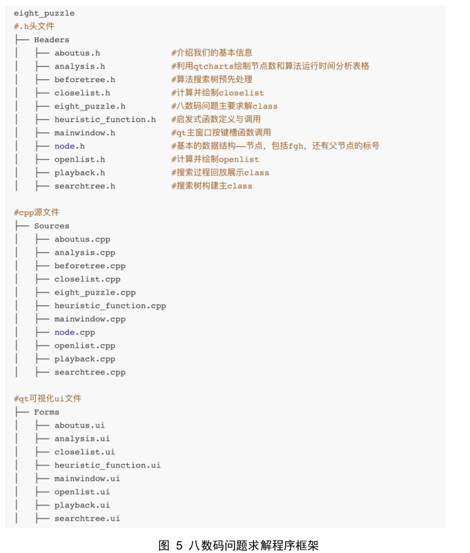

每一个部分的功能在后面都会被详细说明，也会在附件中有专门的mp4文件展示我们程序的运行。

 

2.2.2 主界面实现

主界面的调用通过mainwindow.cpp中的槽函数进行触发，每一个按键对应一个槽函数，通过qt自己的调用机制进行调用。

主界面包括三个3*3的矩阵，分别是初始矩阵，转移矩阵，目标矩阵，通过QLineEdit这个类进行实现和展示，并且将不同的数字对应不同的色块，可以进行随机初始化。

右侧按键包括我们基本信息的展示按键，算法选择按键和算法内容显示按键。

下方按键包括单步执行，连续执行，搜索过程回放，openlist、closelist变化动态展示，搜索树展示，算法分析表格实时分析呈现。

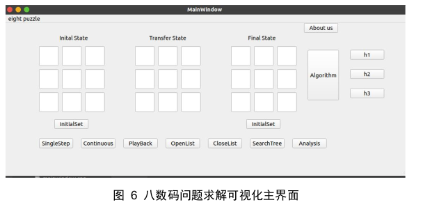

这些按键对应了内部的复杂算法和程序设计，下面也会介绍。

 

### 2.2.3 作者信息展示

作者信息就是一个简单的对话框，包括我们的组员，github仓库（目前还未开放），邮箱联系方式，便于后续我们这一工程进行维护，以及不同的伙伴进行交流提高。

### 2.2.4 启发式函数选择和启发式函数内容展示

算法的选择在内部是通过node这个类的一个静态成员变量实现的，静态成员变量的特点就是保存在堆内，可以通过修改静态成员变量，来使得所有节点都采用同一个启发式函数。通过槽函数的触发，内部的启发式函数就修改为用户希望的函数，同时通过QT的控件的相关设置改变颜色。

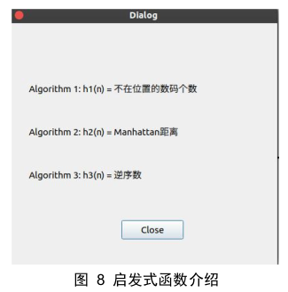

### 2.2.5 连续求解和单步求解

 单步执行和连续执行的本质是同一个求解过程，只是可视化的过程中分步或者连续的区别。求解过程首先读入随机初始化的初始矩阵和目标矩阵，然后根据选择的A*算法的启发式函数进行求解。首先将首个节点加入到openlist中，然后每次选择最小的加入到closelist，不断迭代，直到找到最后的目标节点，然后回溯路径，找到求解出的变换过程。

在可视化过程中，连续执行需要设定延时，防止阻塞进程，由此实现一种动态的效果；而单步执行是通过内部的维护的一个静态变量来进行计数，打印出来第k个矩阵，实现单步执行的效果。

当然，作为一个面向用户的可视化界面，我们不能保证用户的输入或者随即化的输入都有解，所以在读入的时候就进行了数组范围（0-9）的检查，进行了数字输入重复性检查，进行了八数码问题是否有解的检查，这样也避免进入死循环影响程序运行。

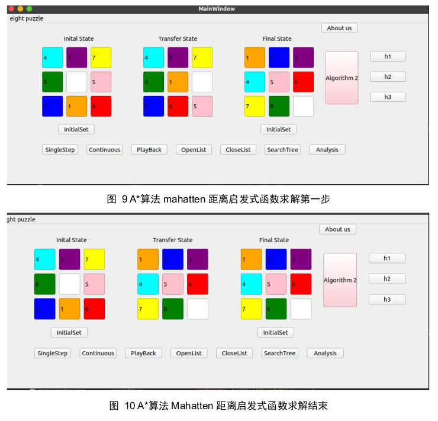

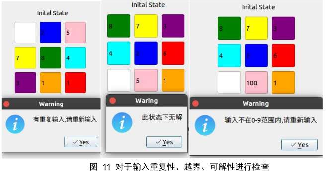

### 2.2.6 openlist, closelist, playback展示

这三个部分的展示内容大同小异，所以放在一起说明。openlist和closelist的展示首先涉及的就是存储问题，我设计了一个二维向量vector<vector<node>>进行存储，在A*算法搜索的每一步都进行存储，然后输出的时候要进行相应的格式化，以及与进程有关的延时处理，然后就在屏幕上展示出我们当前搜索的openlist和closelist变化过程。

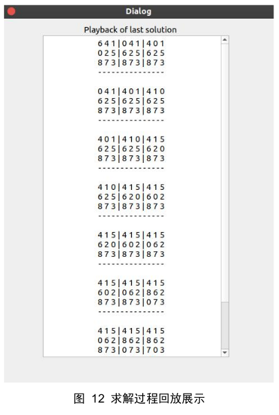

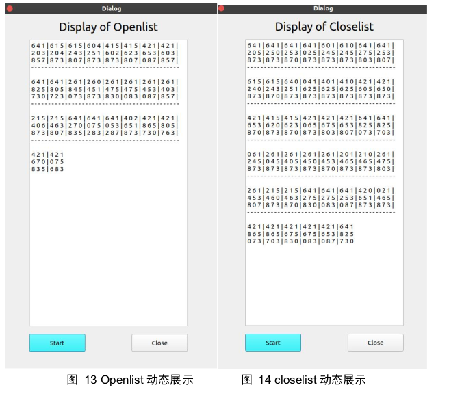

### 2.2.7 启发式函数性能实时分析

启发式函数性能的实时分析就是通过节点数统计、程序运行时间等静态变量进行统计，然后用户点击analysis，会触发内部的槽函数，程序就会在后台进行当前输入矩阵八数码问题的求解，然后得到的结果通过qtcharts进行实时可视化，兼顾数据与美观。

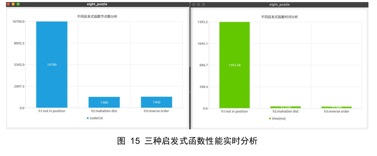

### 2.2.8 搜索树的构建

为了建立搜索树，我们创建了两个h文件，对应于两个cpp文件。

***\*（1）Beforetree.cpp（为建立树传递相应整合过的节点）\****

l void Father_Baby():根据olList得到Tree_Father和TreeBaby

Tree_Father：

父节点集合：vector<node> 类型。父节点由于从openlist加入到closelist中，所以相邻的第二个openlist中缺少了此节点。所以从olList中相邻的两个vector<node>中，找到后者比前者少的节点（按照A*算法，每次比较只会出现一个），此节点就是父节点，加入Tree_Father中;

TreeBaby:

父节点对应子节点组的集合：vector<vector<node>> 类型。

父节点的子节点由于是openlist中新增的，所以相邻的第一个openlist中缺少了此节点。所以从olList中相邻的两个vector<node>中，找到前者比后者少的节点。这些节点就是对应的父节点的子节点，加入Tree_Baby中;并把Tree_Baby中在后续先作为父节点的节点放在前面。再将每次的Tree_Baby加入到TreeBaby，由此TreeBaby的类型为vector<vector<node>>。

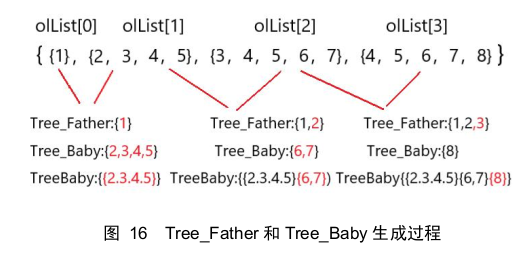

l bool checkMatrixEqual(const int Matrix1[3][3], const int Matrix2[3][3])：确定两个矩阵是否相等。相等返回1，否则返回0。

 

**（2）*****\*seartchtree.cpp（把树绘制在Qt界面上）\****

l void draw_one_matrix(node Node,long long int center_x,long long int center_y, QPainter &painter, QPen &pen)：整个函数的作用是在指定的(center_x,center_y)中心坐标下，画一个八数码九宫格，宫格内的数字由节点node.matrix的3*3矩阵决定。且在矩阵下方写上此九宫格对应的f = g + h;

l void draw_brunch(vector<node> Babynode, long long int center_x,long long int center_y,  long long int child_x,long long int child_y,QPainter& painter, QPen &pen)：输入参数中已知父节点九宫格的位置和子节点九宫格的位置，再调用draw_one_matrix画子节点九宫格，并画上作为树枝的横线。

l void draw_tree(vector<vector<node>> TreeBaby, vector<node> Tree_Father,int n ,QPainter& painter, QPen& pen)：从beforetree中得到Tree_Father,TreeBaby,再根据这两者画树。具体过程为：先把初始的九宫格用draw_one_matrix画出来，再进行循环；每循环一次，就根据父节点对应的子节点在原始树上多画一次。其中如果父节点所在的层数是最下面一层，则新建一层，居左画子节点的九宫格。否则，则在父节点的下面一层的末尾添加子节点。

l void deepFather(vector<node> Tree_Father,vector<vector<node>> TreeBaby)：根据Tree_Father知道当前节点的矩阵，用checkMatrixEqual与deep中的节点比较，得到父节点在那depth层，width列。

l void deeppush(vector<vector<node>> TreeBaby)：用vector<vector<node>> deep储存已经画在树中的节点。第一层为deep[0]，第二层为deep[1],以此类推每次画新的树枝后，都要向deep中添加节点。

l bool checkMatrixEqual(const int Matrix1[3][3], const int Matrix2[3][3])：确定两个矩阵是否相等。相等返回1，否则返回0。

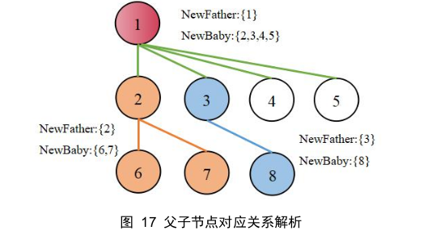

 

最终效果如下：

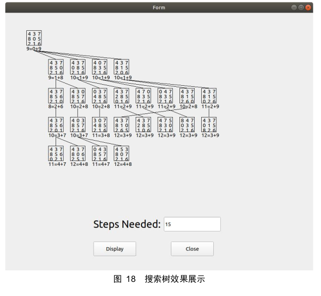

# 3 比较分析

我们对于三种不同的启发式函数进行如下的分析。
h1:用不在位置的数码个数作为启发式函数,计算与目标节点的距离实际值,搜索的效率很低,能得到最优解。
对于不在位置的数码个数,若给予返回值一个权重 k,A*的表现会有所不同。进行性能测试时,取 100 组数据的结果,权重 k 取 9,得到如下的时间表:

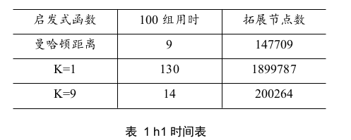

可以看出时间相差极大。通过对不同 K 值下算法所耗时间和 OPEN 表 CLOSE 表中节点数作为对算法性能的评估,建立可视化的权重 K 关于算法性能的折线图,图表如下,评价函数为 f(x)=g(x)+k*h1(x):

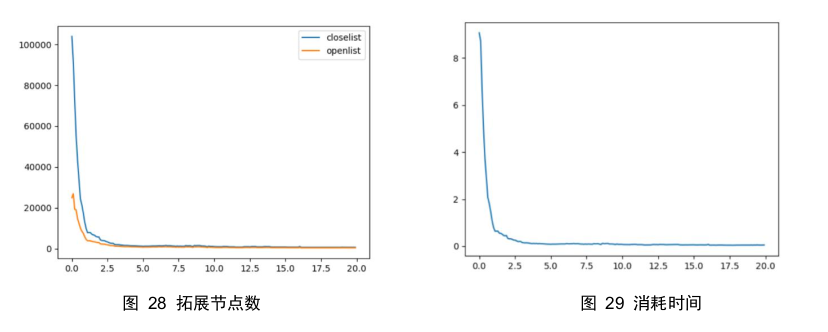

可以看到,K 在 0 变化到 1 的过程中,算法耗时和拓展节点快速下降,之后平稳下降一段,最后基本收敛到一个非常小的值附近。可以认为在 K 值较小的情况下,f(x)受 h(n)影响较小,算法拥有部分广度搜索算法的特性,在 k=0 时直接退化为广度优先搜索,那么效率就是特别慢的。但持续增加 K 值直到足够大的时候,前面的 g(n)已经几乎可以忽略,算法退化为贪婪搜索,所以这时候改变权重并不会得到更优的性能。为验证我们所得结论,我们创建新的评估函数:f(x)=g(x)+k_1*h_1(x)+k_2*h_2( ),其中 h_1 (x)为曼哈顿距离,h_2 (x)为错位棋子数,对其进行三维参数可视化。

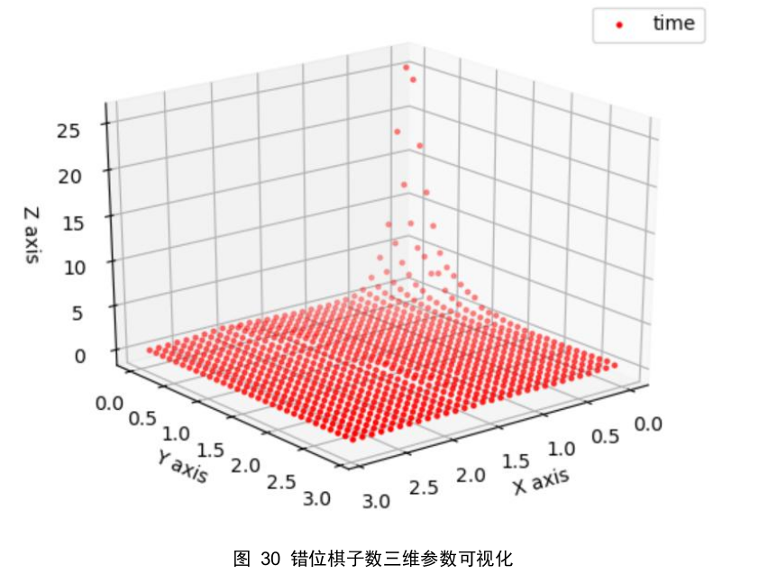

# 4 优化分析

## 4.1 判重优化

在搜索过程中想要提高搜索效率,必不可少的是判重操作,我们利用哈希表进行优化。hash 表通过在存储位置和数据值之间建立映射关系,将操作的时间复杂度降低为 O(1)。hash 函数的作用就是建立存储位置和数据值间的映射关系。将数据存入哈希表时,利用哈希函数为该数据安排存储位置;查找指定值数据时,也按照哈希函数得到目标索引。
利用 hash 表判重,hash 函数的选取比较重要,需要避免冲突现象,即不同的状态对应同一函数值。程序中的 hash 函数就是一个映射函数,将 9 个数映射成 1 个 9 位数,又将这个 9 位数缩小,映射到较小的范围之中。然后就可以将 hash 函数应用于 closelist 和openlist 的创建。在把节点加入 openlist 前先用 hash 判重可以节省时间消耗。

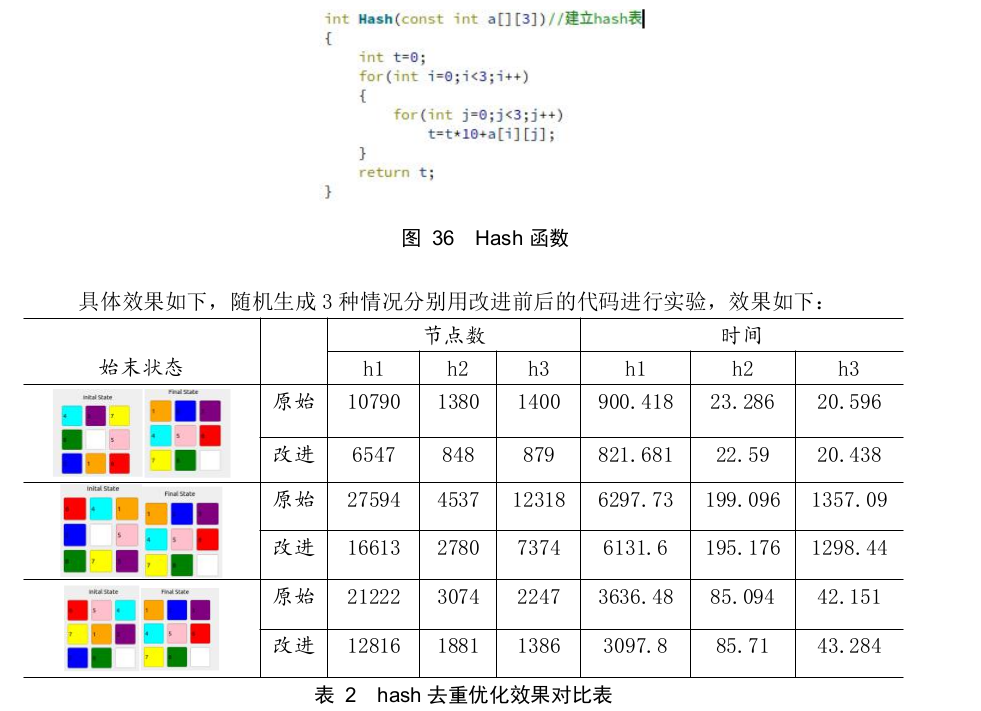

可见在使用 hash 去重优化以后,节点数将会普遍明显减少。在时间性能的提升方面,对于原本就用时较多的 h1 提升较为明显,而对于另外两种启发式函数的提升不是很十分明显。提升多少很大程度上依赖于题目始末状态的情况,原算法中重复较多的路径优化将会较为明显。

## 4.2 逆序数优化

关于逆序数优化分别使用归并排序和树状数组,均将时间复杂度由 O(n )降至 O(nlogn)。
两种优化方法具体如下所示。
首先通过 getReverseOrder(vector<int> list)取到输入的动态数组。

### 4.2.1 树状数组法

1、Sums[9]:树状数组存放位置。
2、update(int x,int value):更新函数,x 为 list 中对应的输入;value=1,用于对输入
的位置进行标记。
3、Lowbit(int i:返回数字 i 二进制形式最低位 1 的对应值。
4、sum[int end]:End 为输入的 a[i]值,利用 lowbit()返回本次行为逆序数的减少值并用
ret 计数。

### 4.2.2 归并排序法

1、L[5],R[5]:分别用于存储归并排序的左半部分和右半部分;
2、Merge(int *data,int left,int divide,int right):Left、right 分别为数组左右端
点,divide 为归并分割点。每当 L[]>R[]时,说明有数字相对位置的调换,此时进行一次计
数,数值为调换时剩余的数组长度。
3、Mergesort(int *data,int left,int right):递归。

考虑到树状数组需要额外的数组统计及函数调用,优化的结果在可接受误差范围之内。
